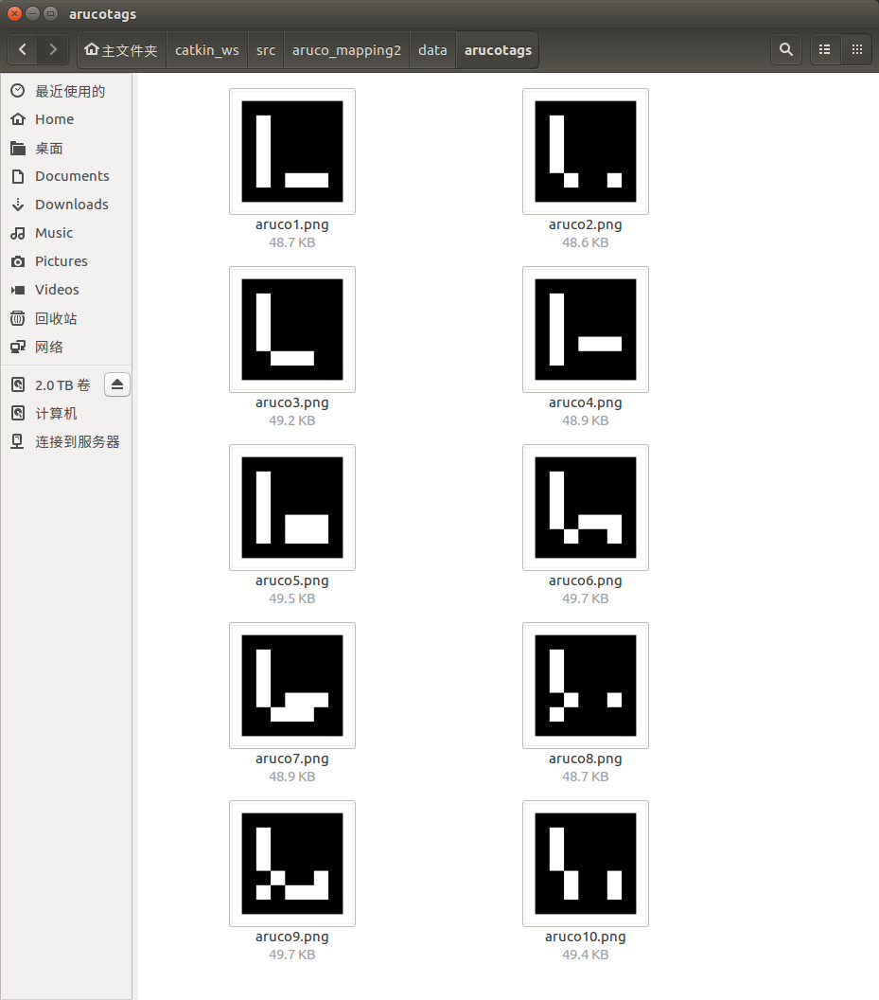
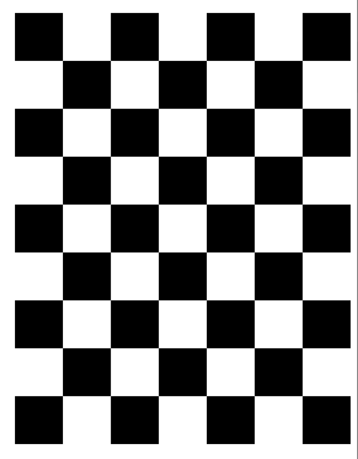
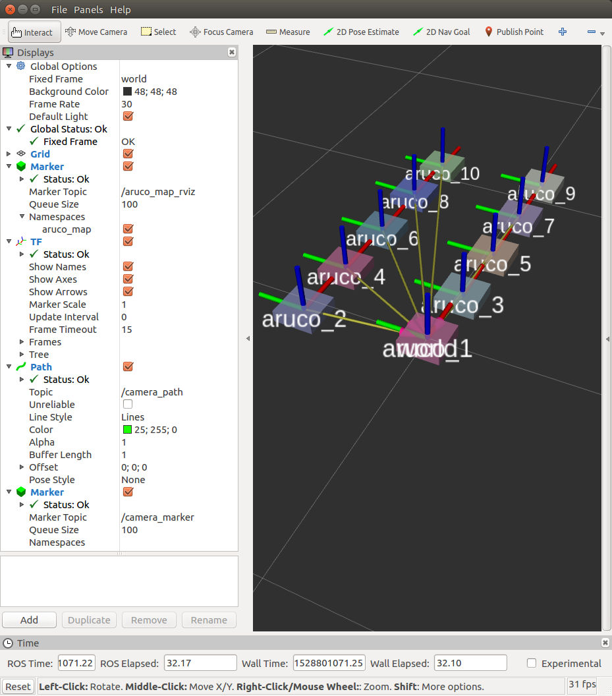
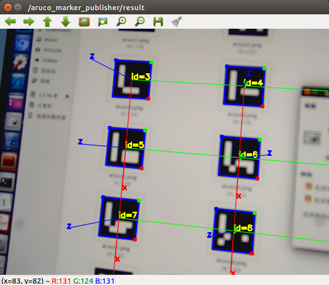

# 代码使用说明


## 1. 打印aruco码

aruco码的图片在`aruco_mapping2/arucotags`文件夹下，里面有1-10的arucotag码。
可以将其打印在A4纸上。

如果要生成更多的arucotag可以在这个网址下生成：
[Aruco Marker Generator](http://terpconnect.umd.edu/~jwelsh12/enes100/markergen.html)


打印完毕之后， 将ArucoTag粘贴到地面/墙面上。

> PS: 在显示器上显示也是可以的。




## 2. USB摄像头的配置
确定usb摄像头的设备号，还有其他参数。
**相关文件** 
> 注： 均需要修改
* calibration.launch
* mapping.launch
* location.launch

```xml
<!--指定USB摄像头设备编号-->
<arg name="video_device" value="/dev/video0" />
<!--画面宽度-->
<arg name="image_width" value="640"/> 
<!--画面高度-->
<arg name="image_height" value="480" />
<!--视频流编码-->
<arg name="pixel_format" value="yuyv" />
<!--设定摄像头的名字-->
<arg name="camera_name" value="usb_cam"/> 
<!--设定摄像头的Frame Id-->
<arg name="camera_frame_id" value="usb_cam" />
<!-- IO方法-->
<arg name="io_method" value="mmap"/>
<!--标定文件的路径-->
<arg name="camera_info_url" value="package://aruco_mapping2/data/usb_cam.yaml"/>
```

## 3. 相机标定

准备一个相机标定板，用A4纸打印出棋盘， 或者使用专门的标定板。
见附件 `aruco_mapping2/data/check-108.pdf`




修改标定板相关的参数配置.
**相关文件** 
* calibration.launch

```xml
<!-- 标定板的格子角点数 (格子行数-1) × （格子列数-1）-->
<arg name="chess_board_size"      value="11x7"/>
<!-- 格子的尺寸 -->
<arg name="chess_square_size" value="0.021" />
```

运行标定程序
```
roslaunch aruco_mapping2 calibration.launch
```


标定软件的使用流程见文章[ROS-单目相机标定流程](http://wiki.ros.org/camera_calibration/Tutorials/MonocularCalibration)
标定完成后会生成`usb_cam.yaml`,里面存储了相机的相机内参,畸变系数等信息.
标定完成结束后,并不会有什么提示, 标定文件默认会存储在`~/.ros/`
标定文件格式是**yaml**, 样例数据如下:
```yaml
image_width: 640
image_height: 480
camera_name: usb_cam
camera_matrix:
  rows: 3
  cols: 3
  data: [913.8178330961418, 0, 340.4649044011426, 0, 910.4095170640226, 183.5485783592703, 0, 0, 1]
distortion_model: plumb_bob
distortion_coefficients:
  rows: 1
  cols: 5
  data: [-0.3943122346178097, 0.1928901709500203, 0.0005343126345678638, -0.003417132633234658, 0]
rectification_matrix:
  rows: 3
  cols: 3
  data: [1, 0, 0, 0, 1, 0, 0, 0, 1]
projection_matrix:
  rows: 3
  cols: 4
  data: [868.0504760742188, 0, 341.267164801322, 0, 0, 880.5822143554688, 180.5321460233499, 0, 0, 0, 1, 0]
```

文件保存路径一般都在用户主目录的`.ros/camera_info`文件夹中.
```bash
fange@cr:~/.ros/camera_info$ cd ~/.ros/camera_info/
fange@cr:~/.ros/camera_info$ ls
usb_cam.yaml
```
复制该文件至项目目录`aruco_mapping2/data` 中.


## 4. 建图 Mapping
接下来进行建图。 修改aruco地图的相关配置。

**相关文件** 
* mapping.launch
* location.launch

```xml
<!-- Aruco Marker的尺寸(宽高相同) 单位m-->
<arg name="marker_size"      value="0.165"/>
<!-- 基准码(世界坐标系)的ID-->
<arg name="base_aruco_id" value="1"/>
<!-- 地图中码的个数 -->
<arg name="aruco_num" value="10"/>
<!--采样帧的个数-->
<arg name="frame_sample_num" value="1000"/>
<!--码与码之间的最远距离-->
<param name="max_distance" value="100"/>

```

运行建图的代码， 手持相机移动采集码与码之间的变化， 注意画面中要至少有两个Aruco码。
```bash
roslaunch aruco_mapping2 mapping.launch
```

建图完成之后， 就会在`aruco_mapping2/data`生成如下.bin文件

* `arucos_dict.bin` 码与码相对变换的原始记录文件
* `aruco_map.bin` 记录aruco地图信息
* `color_dict.bin` 记录每个码的颜色(随机生成)

`RVIZ`上可以显示出来创建的地图，代表建图完成。



`CTRL + C`结束建图进程。


## 5. 相机定位

```bash
roslaunch aruco_mapping2 location.launch
```





